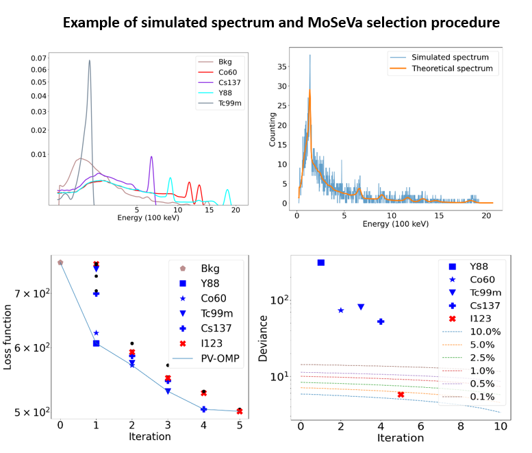

# MoSeVa: model selection with spectral variability based on manifold learning.

This is the repo for MoSeVa: an automatic identification and quantification algorithm which considers spectral variability for gamma-ray spectrometry.

The code is organized as follows:
-  The Code folder contains the source code for the IAE and the MoSeVa,P-OMP algorithm
-  The Data folder contains the dataset of 96 spectral signatures of 12 radionuclides as a function of steel thickness.
-  The Notebooks folder contains two jupyter notebook files for training an IAE model and using MoSeVa to identify and quantify the radionuclides
      - The Models folder contains the pre-trained IAE model.
## Package requirements
MoSeVa was coded using Pytorch. To use MoSeVa, you will need the packages listed in environment.yml. To create and activate a conda environment with all the imports needed, do:
-  conda env create -f environment.yml
-  conda activate pytorch
  
If there is a problem with the installation of Pytorch, please follow this link to install it correctly: [Pytorch](https://pytorch.org/get-started/locally/).
Another way is to use the requirements.txt file:
-  conda install --yes --file requirements.txt
##  Test MoSeVa code
-  Run IAE_CNN_joint_gamma_spectrometry.ipynb if you want to see how IAE works and train a new IAE model with your new data.
-  Run Identification_quantification_variability.ipynb if you want to see how to use MoSeVa.
## Test on another data
-  Replace the data in the Data folder with your own data
-  If you want to use P-OMP (without variabilty):
      - Simply change the data in the file Identification_quantification_variability.ipynb
-  If you want to use MoSeVa (with variabilty):
      - Train a new IAE model in IAE_CNN_joint_gamma_spectrometry.ipynb.
      - Here are a few tips on how to train IAE effectively: increase the number of anchor points if the variability is very complex, increase the number of layers if the result is not very good.
      - Update the new IAE model in Identification_quantification_variability.ipynb. The MoSeVa code normally works well with predefined parameters in the notebook.
        
